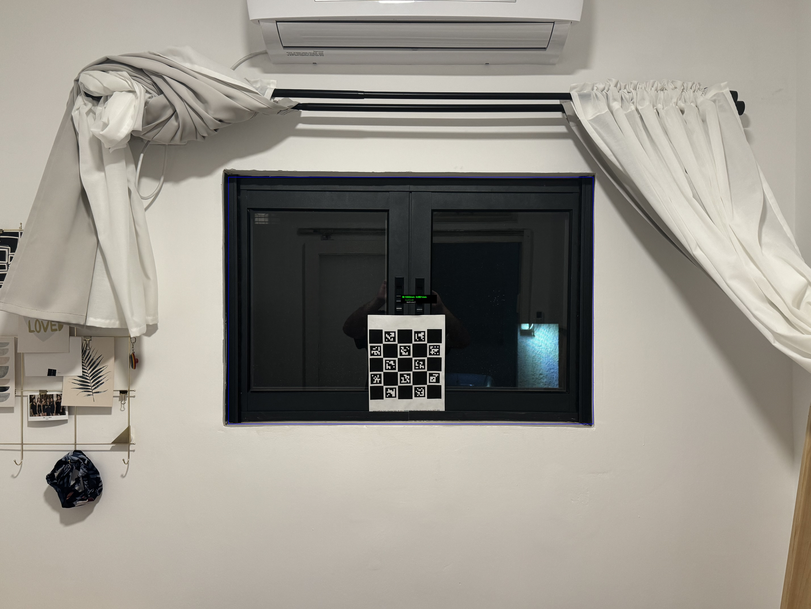

# CV_Model_ChArUco — Real-World Window Frame Measurement using Computer Vision

> **Final Year Project** | B.Sc. Software Engineering, Afeka Academic College of Engineering  
> **Authors:** Yuval Hoffman & Daniel Loevetski

An end-to-end Computer Vision system that **automatically measures window frame dimensions from a single smartphone photo**, achieving sub-3% error against ground truth measurements.

---

## Demo

| Input Image                                   | ChArUco Calibration Detected                         | Measurement Output                          |
| --------------------------------------------- | ---------------------------------------------------- | ------------------------------------------- |
|  |  |  |

The blue contour marks the detected window frame. Measurements are overlaid in real-time with confidence scores.

---

## Results

Tested on 3 real windows across different rooms and lighting conditions (night-time), using 12 images total:

| Window      | Images | Ground Truth (W × H) | Avg Measured (W × H) | Width Error   | Height Error  | Avg Confidence |
| ----------- | ------ | -------------------- | -------------------- | ------------- | ------------- | -------------- |
| Office      | 5      | 980 × 673 mm         | 1008.8 × 697.9 mm    | 28.8mm (2.9%) | 24.9mm (3.7%) | 0.909          |
| Kitchen     | 4      | 1280.5 × 677.5 mm    | 1299.7 × 697.0 mm    | 19.2mm (1.5%) | 19.5mm (2.9%) | 0.899          |
| Living Room | 3      | 1055 × 800 mm        | 1043.7 × 795.1 mm    | 11.3mm (1.1%) | 4.9mm (0.6%)  | 0.904          |

**Average error across all measurements: ~2.0%**  
**Target accuracy: ±10mm** — closely approached on all windows; best results on Living Room (0.6% height error).

Detection confidence scores consistently above **0.88** across all test images.

---

## How It Works

The system combines two Computer Vision components:

### 1. ChArUco Board — Metric Calibration

A ChArUco board (hybrid ArUco + chessboard) is placed in the scene. The system detects the board's inner corners using OpenCV, then calculates a precise **pixel-to-mm ratio** by measuring known distances between adjacent corners.

- Handles partial board occlusion (minimum 4 visible corners required)
- Robust to varying distances from camera to window
- Calibration re-computed per image — no fixed camera required

### 2. YOLOv11-seg — Window Frame Segmentation

A custom-trained YOLOv11 segmentation model detects and segments the window frame. The segmentation mask is then geometrically analyzed using two methods:

- **Minimum Area Rectangle** (weight: 0.7) — most reliable for rectangular objects
- **Contour Analysis** (weight: 0.3) — precise boundary refinement

The 70/30 split was determined empirically — Minimum Area Rectangle proved more stable across varying angles and lighting conditions, while Contour Analysis adds boundary precision but is more sensitive to segmentation noise.

Final dimensions are computed as a **weighted combination** of both methods, scaled by the pixel/mm ratio from calibration.

### Pipeline Overview

```
📷 Image
   │
   ├─► ChArUco Detection ──► pixel/mm ratio
   │
   ├─► YOLOv11 Segmentation ──► binary mask
   │         │
   │         ├─► Min Area Rectangle
   │         └─► Contour Analysis
   │
   └─► Weighted Fusion ──► Width × Height in mm
```

---

## Dataset & Training

- Custom dataset of window frames, labeled for instance segmentation
- Dataset preprocessing: duplicate removal, invalid annotation filtering, 85/15 train/val split
- Training configuration: AdamW optimizer, cosine LR schedule, patience=12
- Augmentations: HSV variation, rotation ±10°, mosaic, mixup, copy-paste
- Hardware: CUDA GPU (tested on CUDA 12.6)

---

## Tech Stack

| Component                       | Technology                             |
| ------------------------------- | -------------------------------------- |
| Object Detection / Segmentation | YOLOv11-seg (Ultralytics)              |
| Calibration                     | OpenCV ChArUco (`cv2.aruco`)           |
| Geometry                        | OpenCV (`minAreaRect`, `findContours`) |
| Deep Learning                   | PyTorch + CUDA                         |
| Data Processing                 | NumPy, Python 3.10+                    |

---

## Project Structure

```
CV_Model_ChArUco/
├── config/
│   └── settings.py                         # All hyperparameters and paths
├── measurement_results/
│   ├── charuco_detection/                  # Visualizations of ChArUco corner detection
│   ├── mask_measurement_results.json       # Full measurement output with confidence scores
│   └── optimal_measured_*.jpg              # Annotated images with measurements overlaid
├── scripts/
│   ├── detect_and_measure_window.py        # Main measurement pipeline
│   ├── predict_on_test_segment.py          # Inference + visualization on test set
│   ├── preprocessing_the_data.py           # Dataset cleaning and split balancing
│   ├── train_yolo_seg.py                   # Model training pipeline
│   └── utils.py                            # Shared utilities (model loading, ChArUco detection)
├── .gitignore
├── Git quick-guide.md                      # Cheat-Sheet for Git CLI
├── README.md
└── requirements.txt
```

---

## Quick Start

### Requirements

- Python 3.10+
- CUDA Toolkit 12.6 (recommended)
- PyTorch with CUDA support

```bash
pip install -r requirements.txt
```

### Run Measurement

```bash
python -m scripts.detect_and_measure_window
```

Results will be saved to `measurement_results/`:

- Annotated images: `optimal_measured_*.jpg`
- Full JSON output: `mask_measurement_results.json`
- ChArUco detection visuals: `charuco_detection/`

### Train Your Own Model

```bash
python -m scripts.train_yolo_seg
```

### Run Inference on Test Set

```bash
python -m scripts.predict_on_test_segment
```

### Preprocess Dataset

```bash
python -m scripts.preprocessing_the_data
```

---

## Limitations & Future Work

> **Note:** The system is designed to detect and measure a single window frame per image (`max_det=1`). For multi-window scenes, this can be adjusted in `utils.py`.

- Requires ChArUco board to be visible in the image (partial occlusion tolerated)
- Accuracy decreases at extreme angles (>30° from perpendicular)
- Future: replace physical board with homography-based calibration using known reference objects
- Future: FastAPI microservice for mobile integration

---

## License

Academic project — for educational and portfolio purposes.
